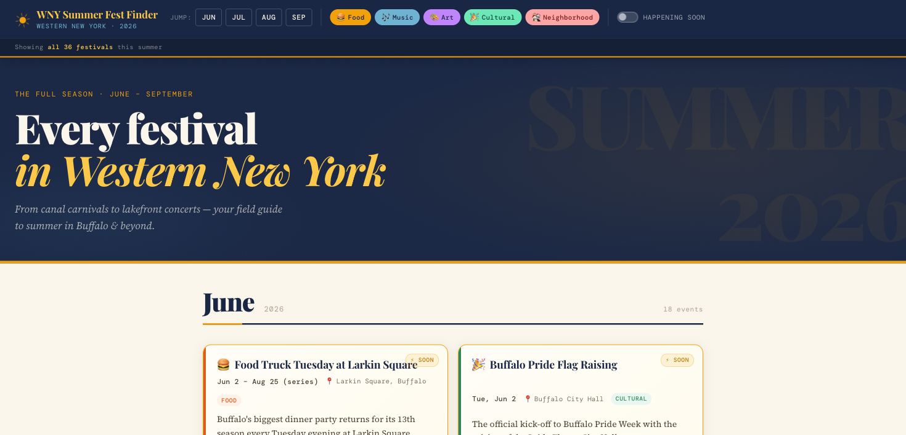

# WNY Summer Fest Finder

A full-season calendar of **Western New York summer 2026 festivals** — June through September — in a single, browsable page. Built as a zero-dependency, vanilla HTML/CSS/JS app: no frameworks, no build step.



## Features

- **Vertical timeline** grouped by month (June · July · August · September)
- **Category filters** — Food · Music · Art · Cultural · Neighborhood
- **🏳️‍🌈 Pride filter** — a cross-cutting tag that surfaces every Buffalo/WNY Pride event (the parade, Intersect, AKG Pride programming, Pridechella, Lockport & Rainbow City Pride, and more)
- **Happening soon** — highlights events within 14 days
- **Jump-to-month** nav, responsive/mobile-first layout, graceful loading/error states

## Run it

The app fetches `data/festivals.json`, so it must be served over HTTP (not opened as `file://`):

```bash
python3 -m http.server 8753
# then open http://localhost:8753/index.html
```

## Data

`data/festivals.json` holds the curated festival list — each entry has `name`, `category`, `start_date`, `end_date`, `location`, `blurb`, `url`, a `confidence` rating, and an optional `pride` tag. Dates and details are subject to change; always confirm with event organizers.

## Project structure

```
index.html          # Header, hero, timeline shell
css/styles.css      # Editorial festival-poster theme
js/app.js           # Loads data, groups by month, filtering
data/festivals.json # Curated WNY summer 2026 festivals
```
